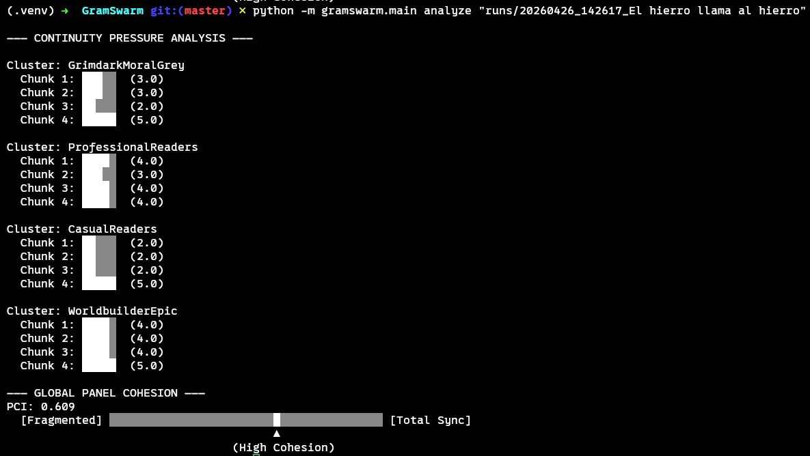

# GramSwarm — Synthetic Alpha Readers

A tool that simulates a panel of alpha readers on a novel-in-progress using LLM agents distilled from real reader profiles.

Instead of asking "is this chapter good?", GramSwarm makes each reader predict what comes next. Tension, boredom, confusion, and abandonment risk are all derived from prediction patterns — not from ratings, which LLMs inflate by default.

## Quick Start

### Installation
GramSwarm uses `uv` for fast, reproducible dependency management.
```bash
# Install dependencies
uv sync
export ANTHROPIC_API_KEY=***
```
You dont need to export your anthropic key if you already have it in your .bashrc/.zshrc

### Running a Simulation
Place your chapter file under `chapters/` as plain text (UTF-8).
```bash
# Run simulation on a chapter
python -m gramswarm.main run chapters/<chapter>.txt

# Run with a custom chunk size
python -m gramswarm.main run chapters/<chapter>.txt --chunk-size 300
```
Loads all profiles from `readers_profiles/` automatically and runs them sequentially. Output goes to `runs/{timestamp}_{chapter}/`.

### Analyzing Results
Quickly eyeball pacing dips and abandonment clustering:
```bash
python -m gramswarm.main analyze runs/<timestamp>_<chapter>
```
Prints a per-cluster bar chart of mean `continue_pressure` per chunk, marking any chunk where at least one reader in that cluster abandoned the reading. In case of abandon in a specific chunk, the chunk is marked with "!". 




## Architecture & Structure

GramSwarm is built as a professional Python package using a layered domain architecture.

```
src/gramswarm/
  core/           # Domain logic, Pydantic schemas, and Simulation Engine
  providers/      # AI Adapters (Anthropic, etc.) with prompt caching
  services/       # IO handlers, Markdown engine, and Analysis tools
  main.py         # CLI entry point
readers_profiles/ # Cluster-based reader personas (.md files)
chapters/         # Manuscript input
runs/             # Output artifacts (Git-ignored)
```

## Metrics Reference

### Per-chunk trace
| Metric | Type | What it measures |
|---|---|---|
| `prediction_next_beat` | free text | What the reader expects to happen next. The primary signal. |
| `prediction_confidence` | 1–5 | How certain the reader is. |
| `open_questions` | list | Questions the reader is actively holding. |
| `active_expectations` | list | Promises the reader believes the author has made. |
| `confusion_points` | list of {quote, why} | Specific sentences where the reader lost the thread. |
| `salience_claim` | 1–5 | How important this chunk feels for the story. |
| `emotional_register` | tone + intensity | What emotional note the scene is playing. |
| `continue_pressure` | 1–5 | Honest urge to keep reading. |
| `would_abandon` | bool + reason | Hard quit signal. |
| `voice_match_check` | score + note | How well this chunk fits the reader's taste. |

### End-of-chapter trace
| Metric | What it measures |
|---|---|
| `summary_as_retained` | What the reader would tell a friend happened. |
| `chapter_sentence_salience` | Which specific sentences the summary draws from. |
| `expectations_carried_forward` | Predictions and promises still open at chapter's end. |
| `tension_self_report` | Where the reader felt pulled, where they drifted. |
| `comparables` | "This reminded me of X" or "This felt like Y trope." |

---

## Research Basis
The trace schema and agent design are grounded in:
- **Argyle et al. 2023** (Silicon sampling)
- **Arora et al. 2025** (Synthetic user validation)
- **NN/G 2025** (Abandonment underreporting)
- **Hullman et al. 2026** (Validation framework)
- **Attention Flows 2026** (Comprehension proxies)
- **Spoiler Alert 2026** (Tension as forecasting disagreement)
